# Cart/checkout ERD (Phase 007 — full detail)

Source of truth for the cart/checkout/pricing/reservation-integration
portion of the `commerce` schema, every column, every FK/UK, and the design
rationale behind the non-obvious choices. The `## commerce` section in
[`erd.md`](./erd.md) is an intentionally abbreviated summary that links
here; this document is the one to update whenever this portion of
`packages/database/prisma/schema.prisma` changes.

Design rationale for the choices below: [`docs/adr/ADR-007-cart-checkout.md`](../adr/ADR-007-cart-checkout.md).
Module-level detail (what reads/writes these tables and how):
[`services/api/src/modules/cart-checkout/README.md`](../../services/api/src/modules/cart-checkout/README.md).

This schema extends Phase 003's placeholder `Cart`/`CartItem` shape (a bare
quantity + price snapshot, `sessionToken`, no configuration, no checkout
concept, no reservation link) rather than replacing it outright — see the
migration's own header comment
(`packages/database/prisma/migrations/20260812225852_cart_checkout_pricing_foundation/migration.sql`)
for the exact mapping, including the one honest note: 0 rows existed in
`carts`/`cart_items` at authoring time, so this is not a data-preserving
migration in the Phase 005/006 sense (the `guest_token` rename still uses
`RENAME COLUMN` for semantic honesty regardless).

## Enums

```
CartStatus              ACTIVE | CHECKOUT_STARTED | ABANDONED | CONVERTED | EXPIRED
ShippingMethodType       HOME_DELIVERY | STORE_PICKUP
CheckoutStatus           OPEN | VALIDATING | READY_FOR_PAYMENT | EXPIRED |
                          CANCELLED | CONVERTED
CheckoutValidationOutcome  PASSED | FAILED
```

`CartStatus` extends Phase 003's 3-value placeholder
(`ACTIVE|CONVERTED|ABANDONED`) with `CHECKOUT_STARTED` and `EXPIRED` — the
two new states this phase's workflow needs (a cart with a checkout in
flight, and the `cart_abandonment` sweep's terminal state).
`CheckoutStatus`'s 6 states are enforced by `CheckoutStateMachine` (domain
layer) before any row is written — see that service's own doc comment for
the exact transition graph.

## Diagram

```mermaid
erDiagram
    carts ||--o{ cart_items : contains
    carts ||--o{ cart_price_snapshots : has
    carts ||--o| cart_coupons : has
    carts ||--o| cart_shipping_selections : has
    carts ||--o{ checkout_sessions : "started from"
    cart_items ||--o{ cart_item_options : has
    shipping_methods ||--o{ cart_shipping_selections : "selected as"
    checkout_sessions ||--o| checkout_addresses : has
    checkout_sessions ||--o{ checkout_totals : has
    checkout_sessions ||--o{ checkout_validations : has
    checkout_sessions ||--o{ checkout_reservations : has

    carts {
        uuid id PK
        uuid customer_id "nullable, -> customer.customers.id, unenforced"
        string guest_token UK "nullable — renamed from session_token"
        enum status "ACTIVE|CHECKOUT_STARTED|ABANDONED|CONVERTED|EXPIRED"
        string currency "default IRR"
        timestamp expires_at "nullable — rolling TTL, reset on every mutation"
    }
    cart_items {
        uuid id PK
        uuid cart_id FK
        uuid product_sku_id "UK with cart_id+configuration_hash, unenforced"
        int quantity
        bigint unit_price_snapshot
        string currency
        json configuration_snapshot "nullable — display-oriented"
        string configuration_hash "default '' — deterministic hash for consolidation"
    }
    cart_item_options {
        uuid id PK
        uuid cart_item_id FK
        string option_type "LENS_TYPE|LENS_COATING|PRESCRIPTION_REFERENCE|CUSTOMIZATION_REFERENCE"
        string option_key "an id/reference, never raw sensitive data"
        string option_label "nullable"
        bigint price_adjustment "nullable"
    }
    cart_price_snapshots {
        uuid id PK
        uuid cart_id FK
        string currency
        bigint subtotal
        bigint discount_total
        bigint tax_total
        bigint shipping_total
        bigint grand_total
        json breakdown "per-line PriceLineBreakdown[], append-only history"
        timestamp calculated_at
    }
    cart_coupons {
        uuid id PK
        uuid cart_id UK "one per cart"
        uuid coupon_id "-> marketing.coupons.id, unenforced"
        string code "denormalized for display"
        bigint resolved_discount "snapshotted at apply-time, re-validated on reprice"
        timestamp applied_at
    }
    shipping_methods {
        uuid id PK
        string code UK
        string name
        enum type "HOME_DELIVERY|STORE_PICKUP"
        bigint base_cost
        bigint free_above_amount "nullable"
        uuid warehouse_id "nullable, -> inventory.warehouses.id, unenforced — set for STORE_PICKUP"
        json zone_match "nullable — {provinces?, cities?}, not a full zone graph"
        boolean is_active
        int sort_order
    }
    cart_shipping_selections {
        uuid id PK
        uuid cart_id UK "one per cart"
        uuid shipping_method_id FK
        bigint estimated_cost
    }
    checkout_sessions {
        uuid id PK
        uuid cart_id FK
        uuid customer_id "nullable, -> customer.customers.id, unenforced"
        string guest_token "nullable — inherited from the source cart"
        enum status "OPEN|VALIDATING|READY_FOR_PAYMENT|EXPIRED|CANCELLED|CONVERTED"
        string currency
        bigint subtotal "fast-read cache"
        bigint discount_total "fast-read cache"
        bigint tax_total "fast-read cache"
        bigint shipping_total "fast-read cache"
        bigint grand_total "fast-read cache"
        json pricing_snapshot "nullable — frozen at READY_FOR_PAYMENT"
        json shipping_snapshot "nullable — frozen at READY_FOR_PAYMENT"
        json address_snapshot "nullable — frozen at READY_FOR_PAYMENT"
        string idempotency_key UK
        timestamp expires_at "nullable — fixed 20-min TTL, extended by refresh()"
        timestamp cancelled_at "nullable"
        timestamp converted_at "nullable"
    }
    checkout_addresses {
        uuid id PK
        uuid checkout_session_id UK "one per session"
        uuid customer_address_id "nullable, -> customer.customer_addresses.id, unenforced"
        string recipient_name
        string phone
        string province
        string city
        string address_line_1
        string address_line_2 "nullable"
        string postal_code "nullable"
    }
    checkout_totals {
        uuid id PK
        uuid checkout_session_id FK
        string currency
        bigint subtotal
        bigint discount_total
        bigint tax_total
        bigint shipping_total
        bigint grand_total
        json breakdown "per-line PriceLineBreakdown[], append-only history"
        timestamp calculated_at
    }
    checkout_validations {
        uuid id PK
        uuid checkout_session_id FK
        enum outcome "PASSED|FAILED"
        json issues "array of {code, message, productSkuId?} — append-only history"
        timestamp validated_at
    }
    checkout_reservations {
        uuid id PK
        uuid checkout_session_id FK
        uuid product_sku_id "UK with checkout_session_id"
        uuid warehouse_id
        uuid inventory_reservation_id "-> inventory.inventory_reservations.id, unenforced"
        int quantity
    }
```



## Key design decisions

**`Cart` and `CheckoutSession` are separate tables, not a shared state
column.** A `Cart` survives across browsing sessions (days); a
`CheckoutSession` is a short-lived snapshot of one (minutes).
`checkout_sessions.cart_id` is the link; the cart's own `status` moves to
`CHECKOUT_STARTED` while a checkout is in flight, so a second concurrent
`POST /checkout` against the same cart is a visible conflict, not silently
allowed to spawn a second in-flight checkout (ADR-007 decision 1).

**Both `Cart` and `CheckoutSession` carry current totals as a fast-read
cache, with `CartPriceSnapshot`/`CheckoutTotals` as the append-only
ledger.** The same cache-plus-ledger split ADR-006 decision 2 established
for `InventoryItem`/`InventoryLedger`, reapplied here because the brief's
own rule is identical: "historical checkout calculations must be
reproducible" (ADR-007 decision 2). Neither snapshot table has an
`updated_at` column, and no repository method updates or deletes a row —
append-only, same convention `InventoryLedger` set.

**No separate `checkout_expiration` table.** `CheckoutSession.expires_at` +
a BullMQ sweep (`checkout_expiration` queue) is the entire mechanism —
mirroring `InventoryReservation.expires_at`'s own shape from Phase 006. No
extra row records every expiry event; that's fully reconstructable from
`status = EXPIRED` + `updated_at` (ADR-007 decision 3).

**`cart_items`'s unique key is `(cart_id, product_sku_id,
configuration_hash)`, not `(cart_id, product_sku_id)` alone.** Phase 003's
original key would force every add of the same SKU to consolidate
regardless of configuration (lens selection, prescription reference) —
`configuration_hash` (a deterministic SHA-256 of the sorted configuration
object, `''` when there's no configuration at all) lets two adds of the
same SKU with _different_ configuration stay distinct lines while two adds
with the _same_ configuration (including "none") consolidate, satisfying
both halves of the brief's cart rules at once.

**`cart_coupons`/`cart_shipping_selections` are `@unique([cart_id])` — one
per cart, not a history.** Unlike `CartPriceSnapshot`, these represent the
cart's _current_ selection, not a ledger of every selection ever made;
re-applying a coupon or re-selecting shipping is an upsert, not a new row.

**`shipping_methods` is one new, deliberately flat table — not a full zone
graph.** `zone_match` is `null` (nationwide) or a simple
`{provinces?, cities?}` match list; `warehouse_id` is set only for
`STORE_PICKUP` methods. No carrier integration, no rate-shopping — a
"shipping cost resolution foundation," per the brief's own wording (ADR-007
decision 7).

**`checkout_reservations` is `@unique([checkout_session_id,
product_sku_id])`** — one row per cart line reserved, remembering _which_
`InventoryReservation` backs _which_ checkout line without duplicating any
reservation state itself (the actual quantity/status/expiry all live in
`inventory.inventory_reservations`, Phase 006's own table, referenced here
only by an unenforced id pointer).

## Cross-schema references (unenforced, same convention as `catalog`/`inventory`)

`carts.customer_id`, `checkout_sessions.customer_id`, and
`checkout_addresses.customer_address_id` reference `customer.customers`/
`customer.customer_addresses` without a database foreign key.
`cart_coupons.coupon_id` references `marketing.coupons.id`.
`shipping_methods.warehouse_id` references `inventory.warehouses.id`.
`checkout_reservations.inventory_reservation_id` references
`inventory.inventory_reservations.id`. All unenforced, same rationale
`docs/database/README.md`'s "Cross-schema references are intentionally
unenforced" section gives for every other cross-schema pointer in this
repo.

## Migration

`packages/database/prisma/migrations/20260812225852_cart_checkout_pricing_foundation/`
— hand-authored, with a `down.sql` verified via a full up → down → up round
trip against real Postgres, repeated twice for reproducibility (`prisma
migrate diff` confirmed zero drift at every step; `catalog.products` and
`inventory.warehouses` row counts were confirmed intact throughout both
rounds). `CartStatus`'s two new enum values (`CHECKOUT_STARTED`,
`EXPIRED`) are **not** removed by `down.sql` — Postgres has no `ALTER TYPE
... DROP VALUE` — so the forward migration wraps each `ADD VALUE` in a
`DO $$ ... IF NOT EXISTS ... $$` guard, making a rollback-then-reapply
cycle safe (confirmed empirically: a bare re-run of `ADD VALUE` on an
already-added value fails with "enum label already exists" without the
guard).
