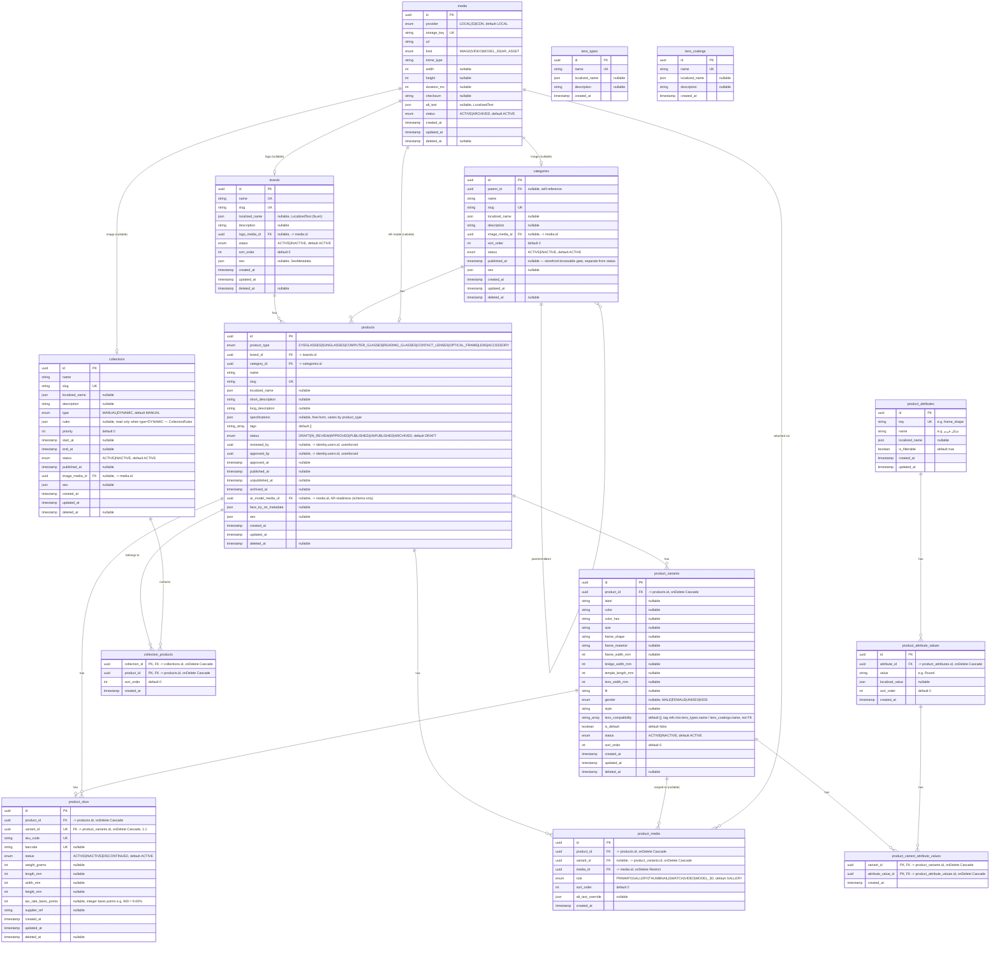

# Catalog ERD (Phase 005 — full detail)

Source of truth for the `catalog` schema, every column, every FK/UK, and the
design rationale behind the non-obvious choices. The `## catalog` section in
[`erd.md`](./erd.md) is an intentionally abbreviated summary that links here;
this document is the one to update whenever `catalog`'s section of
`packages/database/prisma/schema.prisma` changes.

Design rationale for the choices below: [`docs/adr/ADR-005-catalog-architecture.md`](../adr/ADR-005-catalog-architecture.md).
Module-level detail (what reads/writes these tables and how):
[`services/api/src/modules/catalog/README.md`](../../services/api/src/modules/catalog/README.md).

## Enums

```
ProductGender           MALE | FEMALE | UNISEX | KIDS
ProductType              EYEGLASSES | SUNGLASSES | COMPUTER_GLASSES |
                          READING_GLASSES | CONTACT_LENSES | OPTICAL_FRAME |
                          LENS | ACCESSORY
ProductLifecycleStatus   DRAFT | IN_REVIEW | APPROVED | PUBLISHED |
                          UNPUBLISHED | ARCHIVED
CatalogStatus             ACTIVE | INACTIVE
SkuStatus                 ACTIVE | INACTIVE | DISCONTINUED
CollectionType             MANUAL | DYNAMIC
MediaProvider              LOCAL | S3 | CDN
MediaKind                  IMAGE | VIDEO | MODEL_3D | AR_ASSET
MediaRole                  PRIMARY | GALLERY | THUMBNAIL | SWATCH | VIDEO |
                          MODEL_3D
MediaStatus                ACTIVE | ARCHIVED
```

`ProductLifecycleStatus` is the 6-state publication graph enforced by
`ProductLifecycleStateMachine` (domain layer) before any row is ever
written — see that service's own doc comment for the exact transition
graph (`DRAFT → IN_REVIEW → APPROVED → PUBLISHED → UNPUBLISHED`, plus
`ARCHIVED` reachable from any non-archived state). `CatalogStatus` is the
simpler on/off switch used by entities that don't need the full workflow
(brand, category, collection, variant). `SkuStatus` adds `DISCONTINUED`,
distinct from `INACTIVE`, because a discontinued SKU stays queryable
(existing orders/inventory history still reference it) but can never be
reactivated for sale the way a merely-inactive one can.

## Diagram



## Notes on individual tables

### `brands`, `categories`, `collections` — merchandising shells

All three share the same shape: a `status` on/off switch, an optional
`Media` reference (`logo_media_id`/`image_media_id`), and a `seo` JSON
column (`SeoMetadata` — title/metaDescription/canonicalUrl/ogImage/noIndex,
see ADR-005 decision 3). `categories` additionally self-references via
`parent_id` for unlimited-depth nesting (cycle-checked in the domain layer
by `CategoryHierarchyService.wouldCreateCycle`, a pure in-memory function
over an already-loaded snapshot — not a per-insert recursive SQL check) and
carries a separate `published_at` — a category can be `ACTIVE` (administra-
tively usable, e.g. assignable to a product) without yet being
storefront-browsable.

`collections` is `MANUAL` (membership is the explicit `collection_products`
join row, with its own admin-controlled `sort_order`) or `DYNAMIC` (`rules`
is read at query time by `CollectionRuleEvaluator`; see ADR-005 decision 4
for why this is a narrow fixed shape —
`{brandId?, categoryId?, tags?, gender?, productType?}` — and not a general
rule engine). `start_at`/`end_at` let a dynamic or manual collection be
scheduled (e.g. a seasonal campaign) without a cron job flipping `status`.

### `products` — the aggregate root, not itself sellable

`products` holds everything that describes _what the item is_, not what it
costs or how many are in stock — see `product_skus` below and ADR-005
decision 1. `status` is `ProductLifecycleStatus`, driven only through
`ProductLifecycleStateMachine.assertTransition`; every write to this column
happens through `ProductsService`, never a raw Prisma `update` from a
controller. `reviewed_by`/`approved_by` are plain `uuid` columns pointing at
`identity.users.id` — unenforced cross-schema references, per this repo's
established convention (see [`README.md`](./README.md#cross-schema-references-are-intentionally-unenforced)).
`ar_model_media_id`/`face_try_on_metadata` are the AR-readiness columns the
brief asked for — schema only, no AR engine reads them yet (ADR-005
decision 3 / "Deferred"). `specifications` is deliberately free-form JSON
(not a fixed column set) because it varies hugely by `product_type` — a
frame's spec sheet and a contact lens's spec sheet share almost nothing.

### `product_variants` vs. `product_skus` — the Phase 005 split

Full rationale: ADR-005 decision 1. In short:

- **`product_variants`** is the merchandising configuration an admin picks
  when authoring a product — color, size, frame/lens measurements, fit,
  style, gender, lens compatibility tags. No price, cost, barcode, or
  weight lives here.
- **`product_skus`** is the commerce unit — SKU code, barcode, physical
  dimensions/weight for shipping, tax rate, supplier reference — the row
  `finance.product_prices` and `inventory.inventory_items` actually key
  off (via `product_sku_id`, an unenforced cross-schema column on both).

Exactly one SKU per variant this pass (`product_skus.variant_id` is
`UNIQUE`) — a variant can exist without a SKU yet (mid-authoring, before
it's ready to sell), never the reverse. Multi-SKU-per-variant (e.g. the
same merchandising configuration sold under two supplier contracts) is
explicitly deferred — see ADR-005's "Deferred" section.

### `product_attributes` / `product_attribute_values` / `product_variant_attribute_values` — admin-defined EAV

Carried over from Phase 003 (blueprint §9/§11's Dynamic Filter Engine —
admin adds a new attribute/value without a redeploy), now localizable
(`localized_name`/`localized_value`) and explicitly filterable-flagged
(`is_filterable`) rather than assumed. `product_variant_attribute_values`
is the join row assigning one attribute value to one variant; the domain
layer (`AttributeValueValidator.assertNoDuplicateAttributes`) rejects
assigning two different values of the _same_ attribute to one variant even
though the table itself has no partial-uniqueness constraint enforcing that.

### `media` / `product_media` — storage-agnostic asset library

`media` is provider-agnostic by construction (`provider` + `storage_key` is
the abstraction seam — ADR-005 decision 3; nothing in the catalog domain
imports an S3/CDN SDK directly). `kind = MODEL_3D | AR_ASSET` is the
AR-readiness hook `products.ar_model_media_id` points into. `product_media`
attaches one `media` row to a product (`variant_id = null`) or to one
specific variant (e.g. a colorway's own gallery shot); `media_id` uses
`onDelete: Restrict` — a `media` row still referenced by a `product_media`
row can't be silently deleted out from under the product, it must be
detached first. `PRIMARY`-role exclusivity per product/variant scope is
enforced in `MediaService`, not a DB constraint — see
`services/api/src/modules/catalog/README.md`'s "Media" section for why (no
partial unique index this pass).

### `lens_types` / `lens_coatings` — standalone lookup tables

Carried over unchanged from Phase 003. No FK from `product_variants` — a
variant's `lens_compatibility` is a `string[]` of tag references matched
against these tables' `name` column by application code, not a relational
join. The full lens configuration/compatibility/pricing engine (index,
coating combinations, pricing rules) remains out of scope — see ADR-005's
"Deferred" section, unchanged from Phase 003's own scope note.

## Cross-schema references out of `catalog`

Per this repo's [unenforced-cross-schema convention](./README.md#cross-schema-references-are-intentionally-unenforced),
none of these are real Postgres foreign keys:

| Column                                     | Points at                 | Notes                                                                                                                                      |
| ------------------------------------------ | ------------------------- | ------------------------------------------------------------------------------------------------------------------------------------------ |
| `products.reviewed_by`                     | `identity.users.id`       | nullable, set by `submitForReview`                                                                                                         |
| `products.approved_by`                     | `identity.users.id`       | nullable, set by `approve`                                                                                                                 |
| `finance.product_prices.product_sku_id`    | `catalog.product_skus.id` | Phase 005 — was `product_variant_id`                                                                                                       |
| `finance.price_history.product_sku_id`     | `catalog.product_skus.id` | Phase 005 — was `product_variant_id`                                                                                                       |
| `inventory.inventory_items.product_sku_id` | `catalog.product_skus.id` | Phase 005 — was `product_variant_id`                                                                                                       |
| `commerce.cart_items.product_sku_id`       | `catalog.product_skus.id` | Phase 005 — was `product_variant_id`                                                                                                       |
| `commerce.order_items.product_sku_id`      | `catalog.product_skus.id` | Phase 005 — was `product_variant_id`; still snapshots `sku`/`name`/`unit_price` at order time, see [`README.md`](./README.md) convention 7 |

## Migration history for this schema

- `20260811181736_init_enterprise_foundation` (Phase 003) — original
  `catalog` schema: `products` (with a bare `sku`/`gender`/`description`),
  `product_variants` (carrying commerce fields directly), `product_images`,
  `product_attributes`/`product_attribute_values`, `lens_types`,
  `lens_coatings`.
- `20260812105606_catalog_merchandising_foundation` (Phase 005, this
  document) — the rewrite above: `brands`/`categories` gained SEO/
  localization/media fields; `products` gained the 6-state lifecycle,
  `tags`, review/approval/publish timestamps, AR-readiness fields, SEO;
  `product_variants` was stripped to pure merchandising fields; the new
  `product_skus` table became the sellable/priced/inventoried unit;
  `product_images` was dropped in favor of the storage-agnostic `media` +
  `product_media` pair; `collections`/`collection_products` were added;
  `product_attributes`/`product_attribute_values` gained localization and
  `is_filterable`. Hand-authored `migration.sql`/`down.sql` (data-preserving
  nullable → backfill → NOT NULL pattern throughout); verified via a full
  up → down → up round trip against a real local Postgres with zero drift
  (`prisma migrate diff`) at every step.
