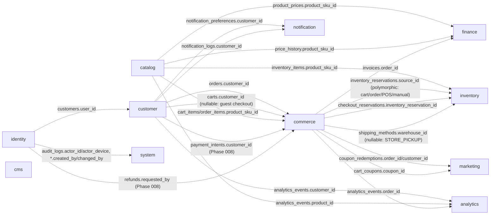
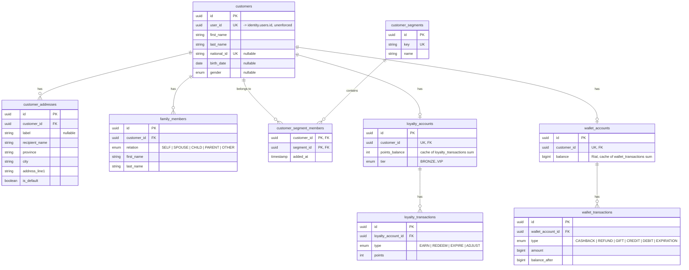
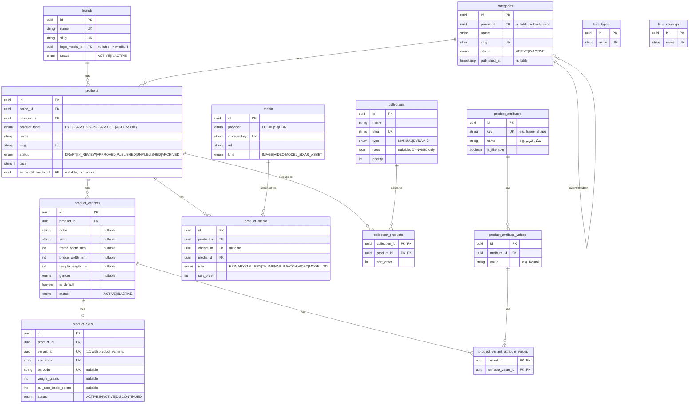
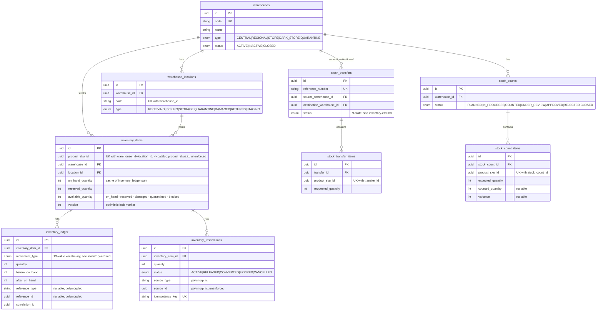
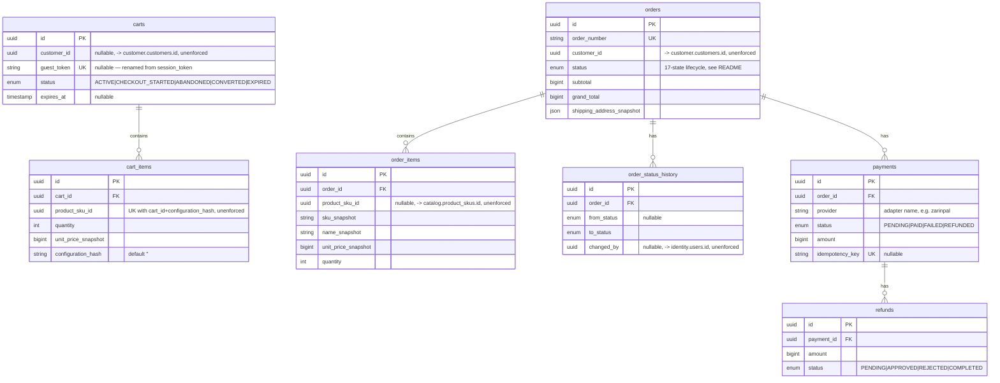
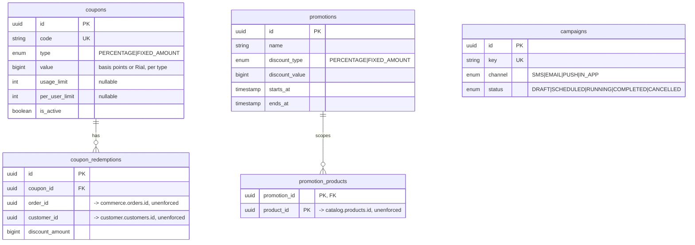
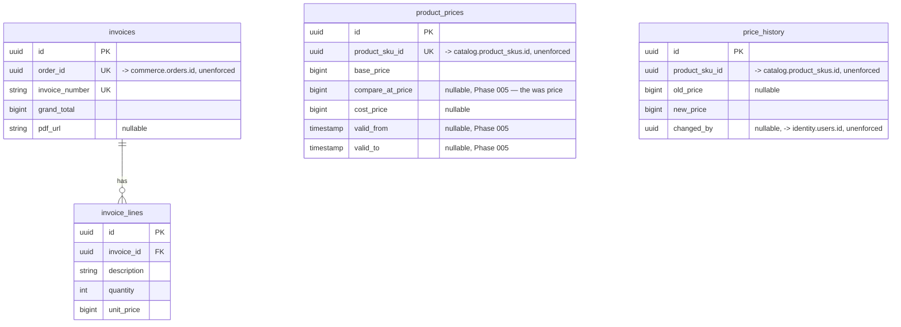
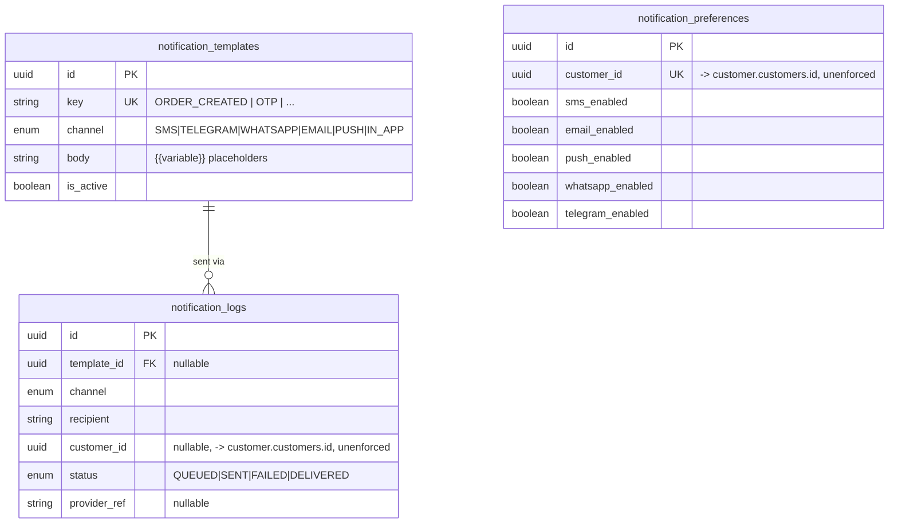
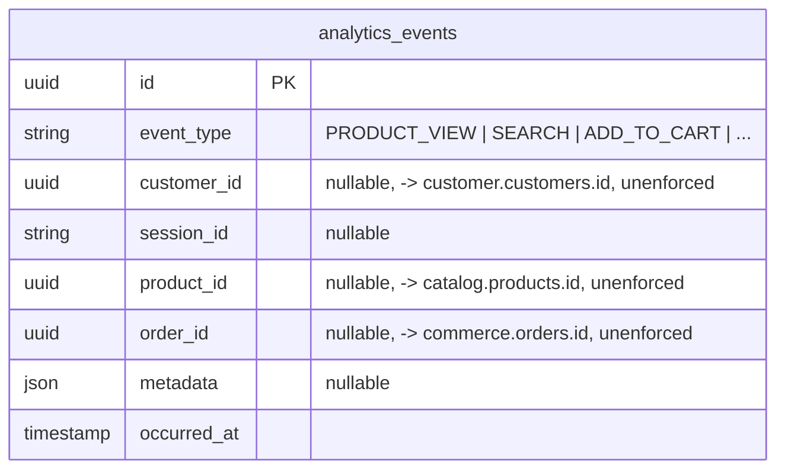
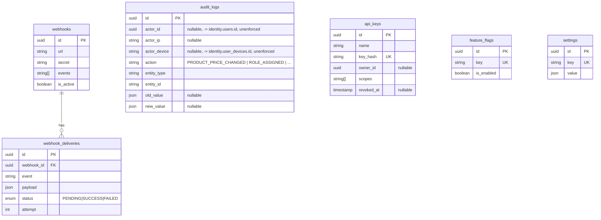

# Entity-Relationship Diagrams

Generated from `packages/database/prisma/schema.prisma` as of migration
`20260811181736_init_enterprise_foundation`. Table/column names below are the
real PostgreSQL names (`snake_case`, from each model's `@@map`/`@map`) — not
the Prisma field names — since this document describes the database, not the
client.

**Omitted from every diagram for readability**: `created_at`, `updated_at`,
`deleted_at`. Which of the three a given table actually has follows the
three-tier convention in [`README.md`](./README.md#conventions) (lifecycle /
append-only / join table) — check the table's tier there, don't assume all
three exist.

**A relationship line means an enforced PostgreSQL `FOREIGN KEY`.** Every
foreign key in this schema is intra-schema — see
["Cross-schema references are intentionally unenforced"](./README.md#cross-schema-references-are-intentionally-unenforced)
for why. The [Cross-schema overview](#cross-schema-overview) below shows the
_logical_ references that exist between schemas as plain, unenforced UUID
columns (dashed arrows) — do not read those as FK constraints.

## Cross-schema overview

## identity

`otp_requests` has no FK — it's keyed by `phone` directly (a request can
precede account creation, e.g. registration OTP). `roles.parent_id` is a
self-reference: a role's effective permissions are its own `role_permissions`
rows unioned with every ancestor's, resolved in application code (Phase 004's
`PermissionResolver`), not a recursive query baked into the schema.
`user_permission_overrides` is the per-user exception on top of that
resolved set — `DENY` always wins over any role-derived grant, `ALLOW`
grants something no assigned role does.

## customer

## catalog

Phase 005 (see [`catalog-erd.md`](./catalog-erd.md) for the full diagram with
every column and design rationale) substantially extended this schema —
`brands`/`categories`/`products` gained SEO/localization/media fields,
`product_variants` split into a merchandising row (this table) and a new
`product_skus` table (the sellable/priced/inventoried unit — see
[`docs/adr/ADR-005-catalog-architecture.md`](../adr/ADR-005-catalog-architecture.md)
decision 1), `product_images` was replaced by a storage-agnostic `media` +
`product_media` pair, and two new tables (`collections`,
`collection_products`) were added. The summary below is intentionally
abbreviated; `catalog-erd.md` is the source of truth for this schema going
forward.

`lens_types` / `lens_coatings` are standalone lookup tables — no FK yet. The
full lens configuration/compatibility/pricing engine is out of scope for this
foundation pass (see [`README.md`](./README.md#deliberately-out-of-scope)).

## inventory

Phase 006 (see [`inventory-erd.md`](./inventory-erd.md) for the full diagram
with every column and design rationale) completely rewrote this schema —
`warehouses` gained `type`/`status`/`timezone`/`capacity`, a new
`warehouse_locations` table was added (a warehouse must have ≥1 location
before it can hold stock), `inventory_items` moved to a
`(product_sku_id, warehouse_id, location_id)` key with a full 7-bucket
quantity model, `inventory_transactions`/`stock_reservations` were replaced
by `inventory_ledger` (append-only, 13-value movement-type vocabulary) and
`inventory_reservations` (idempotency-key-protected), and four new tables
(`inventory_thresholds`, `stock_transfers`/`stock_transfer_items`,
`inventory_adjustments`, `stock_counts`/`stock_count_items`) were added. The
summary below is intentionally abbreviated; `inventory-erd.md` is the source
of truth for this schema going forward.

`inventory_ledger` is the append-only ledger (no `updated_at`, never
updated/deleted); `inventory_items`' quantity buckets are a maintained
cache, never the source of truth. `available_quantity >= 0` is enforced
transactionally (`SELECT ... FOR UPDATE` + a domain-layer assertion), not by
a database `CHECK` constraint — Prisma has no `@@check(...)` support (see
`inventory-erd.md`).

## commerce

Phase 007 (see [`cart-checkout-erd.md`](./cart-checkout-erd.md) for the
full diagram with every column and design rationale) extended `carts`/
`cart_items` (`session_token` renamed `guest_token`, `configuration_hash`/
`configuration_snapshot` added) and added 10 new tables:
`cart_item_options`, `cart_price_snapshots`, `cart_coupons`,
`shipping_methods`, `cart_shipping_selections`, and the entire
`checkout_sessions`/`checkout_addresses`/`checkout_totals`/
`checkout_validations`/`checkout_reservations` subtree. Phase 008 (see
[`payment-erd.md`](./payment-erd.md) for the full diagram) then dropped
the placeholder `payments`/`refunds`/`PaymentStatus`/`RefundStatus` shown
below and replaced them with a real 7-table payment orchestration subtree
(`payment_providers`, `payment_intents`, `payment_attempts`,
`payment_transactions`, `payment_callbacks`, `refunds`,
`reconciliation_records`) keyed off `checkout_sessions`, not `orders`. The
summary below is intentionally abbreviated (it still shows the Phase 003
placeholder `payments`/`refunds` shape for historical continuity with the
diagram beneath it, and omits every Phase 007/008 addition entirely — see
`cart-checkout-erd.md` and `payment-erd.md` for those); both are the
source of truth for their half of this schema going forward, same
convention `inventory-erd.md` set above.

`order_items` snapshots `sku`/`name`/`unit_price` at creation — an order's
totals never change because the live product changed later
("order ≠ live product", see [`README.md`](./README.md#conventions)).

**The `payments`/`refunds` tables shown above are the Phase 003 placeholder
shape and no longer exist** — Phase 008 dropped them and replaced them with
a real 7-table payment orchestration subtree keyed off `checkout_sessions`
rather than the non-existent `Order` flow. See
[`payment-erd.md`](./payment-erd.md) for the current, real shape; kept here
unedited only so this diagram still matches what earlier phases' own
diagrams referenced at the time they were written.

## marketing

`promotions` is a basic all-or-nothing discount scoped to specific products —
the full condition/rule engine (segment + category + cart-total conditions)
is deliberately out of scope for this pass. `campaigns` has no child tables
yet (no send-log — that's `notification.notification_logs`, correlated by
convention, not FK).

## cms

`page_sections.config` (JSON) is the Section Builder — new section types are
data, not a migration or a frontend redeploy. `banners`/`articles`/`faqs`
have no parent table; each is independently admin-managed.

## finance

Pricing is deliberately its own domain, not a column on `catalog.products` —
exactly one active `product_prices` row per SKU (Phase 005 — previously per
variant); every change is recorded in the append-only `price_history`,
never a silent overwrite. See `docs/database/catalog-erd.md` for the full
Phase 005 catalog schema this now keys off.

## notification

`notification_preferences` — explicit per-channel opt-in, checked before
every send (defaults to enabled; no silent SMS to someone who disabled it).

## analytics

One generic, append-only event table rather than a bespoke table per event
type. Promote a specific `event_type` to its own structured table only once
it needs real relational querying beyond `metadata` filtering.

## system

`audit_logs` is the append-only "who changed what" record (blueprint §54) —
every sensitive mutation across every schema should write one of these;
nothing is ever updated after insert. `settings.value` is JSON so each
setting's shape is whatever that setting needs, not a fixed column set.
