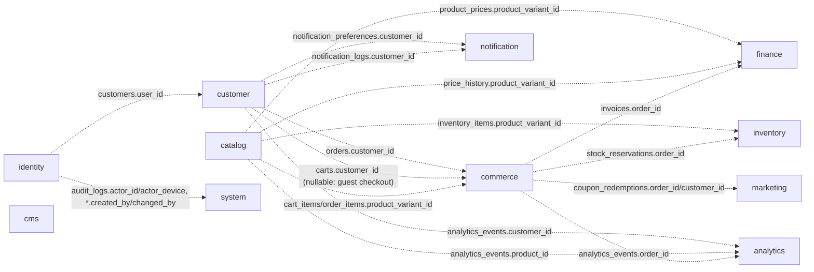
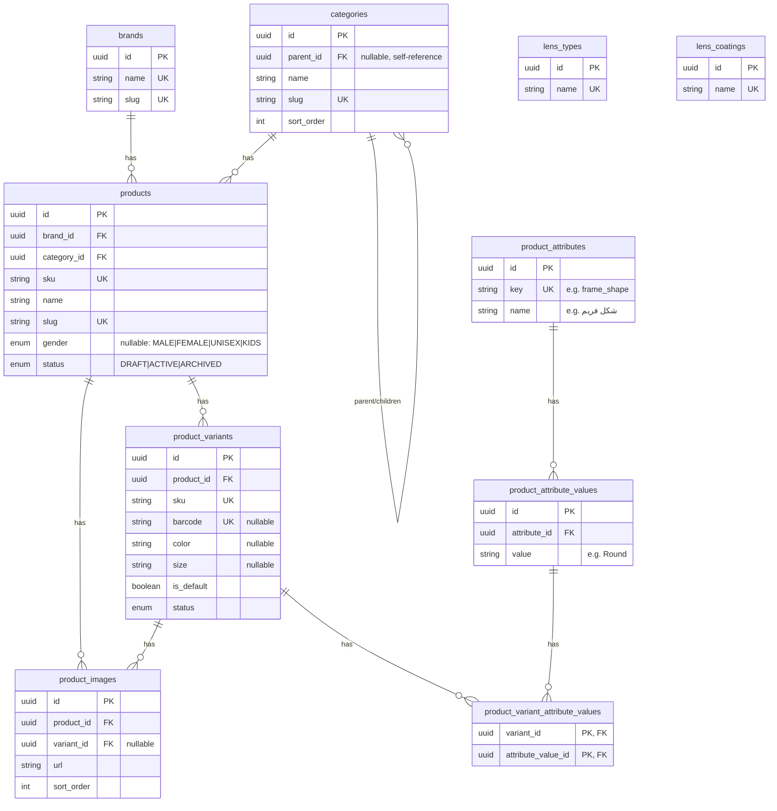
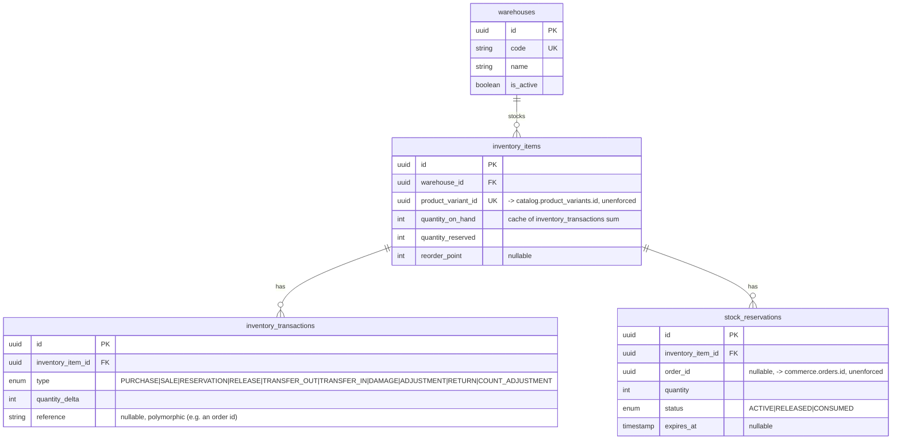
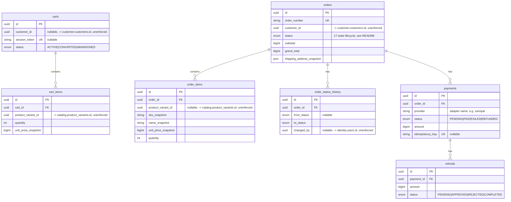
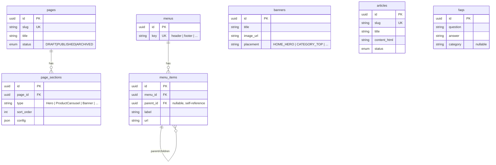
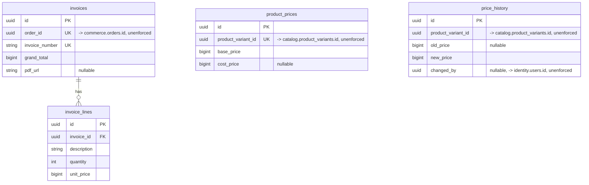
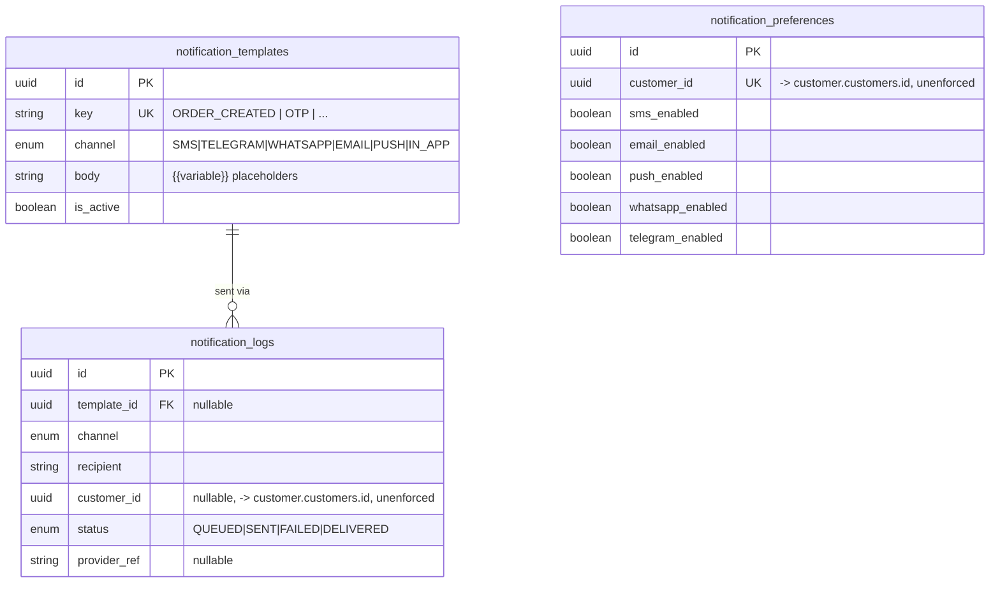
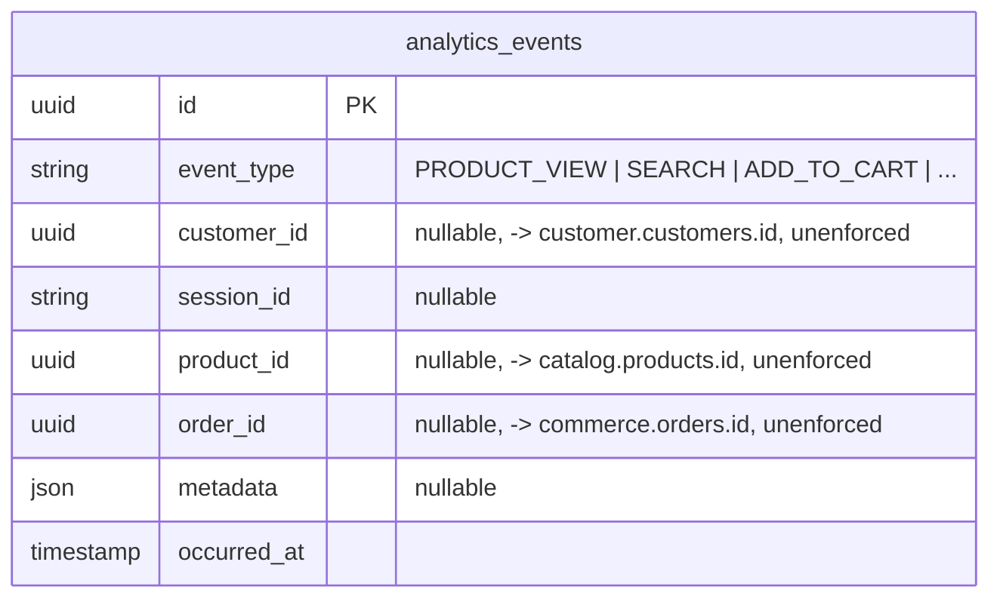
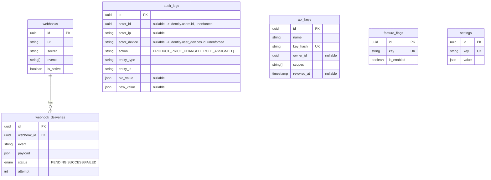

# Entity-Relationship Diagrams

Generated from `packages/database/prisma/schema.prisma` as of migration
`20260811181736_init_enterprise_foundation`. Table/column names below are the
real PostgreSQL names (`snake_case`, from each model's `@@map`/`@map`) — not
the Prisma field names — since this document describes the database, not the
client.

**Omitted from every diagram for readability**: `created_at`, `updated_at`,
`deleted_at`. Which of the three a given table actually has follows the
three-tier convention in [`README.md`](./README.md#conventions) (lifecycle /
append-only / join table) — check the table's tier there, don't assume all
three exist.

**A relationship line means an enforced PostgreSQL `FOREIGN KEY`.** Every
foreign key in this schema is intra-schema — see
["Cross-schema references are intentionally unenforced"](./README.md#cross-schema-references-are-intentionally-unenforced)
for why. The [Cross-schema overview](#cross-schema-overview) below shows the
_logical_ references that exist between schemas as plain, unenforced UUID
columns (dashed arrows) — do not read those as FK constraints.

## Cross-schema overview

## identity

```mermaid
erDiagram
    users ||--o{ user_sessions : has
    users ||--o{ user_roles : has
    users ||--o{ user_devices : has
    users ||--o| user_two_factor_credentials : has
    users ||--o{ user_permission_overrides : has
    users ||--o{ security_events : has
    user_devices ||--o{ user_sessions : "issued from"
    roles ||--o{ user_roles : has
    roles ||--o{ role_permissions : has
    roles ||--o{ roles : "parent/children"
    permissions ||--o{ role_permissions : has
    permissions ||--o{ user_permission_overrides : has

    users {
        uuid id PK
        string phone UK
        string email UK "nullable"
        string password_hash "nullable"
        boolean is_active
        timestamp phone_verified_at "nullable"
        timestamp last_login_at "nullable"
    }
    user_devices {
        uuid id PK
        uuid user_id FK
        string fingerprint "hash of UA + platform + install id"
        string label "nullable, e.g. Ali's iPhone"
        string platform "nullable"
        timestamp trusted_at "nullable — blueprint Device Trust"
        timestamp last_seen_at
        timestamp revoked_at "nullable"
    }
    user_sessions {
        uuid id PK
        uuid user_id FK
        uuid device_id FK "nullable"
        string refresh_token_hash UK
        string user_agent "nullable"
        string ip_address "nullable"
        timestamp expires_at
        timestamp revoked_at "nullable"
    }
    user_two_factor_credentials {
        uuid id PK
        uuid user_id "UK, FK"
        enum method "TOTP"
        string secret_encrypted "AES-256-GCM ciphertext, never raw"
        string[] recovery_codes_hashed
        boolean enabled
        timestamp verified_at "nullable"
    }
    otp_requests {
        uuid id PK
        string phone
        string code_hash
        string purpose "LOGIN | REGISTER | RESET_PASSWORD"
        int attempts
        timestamp expires_at
        timestamp consumed_at "nullable"
    }
    roles {
        uuid id PK
        uuid parent_id FK "nullable, self-reference — inheritance"
        string name UK
        boolean is_system
    }
    permissions {
        uuid id PK
        string module "e.g. identity"
        string action "e.g. users.view_contact"
        string key UK "module + '.' + action"
    }
    role_permissions {
        uuid role_id "PK, FK"
        uuid permission_id "PK, FK"
    }
    user_roles {
        uuid user_id "PK, FK"
        uuid role_id "PK, FK"
    }
    user_permission_overrides {
        uuid id PK
        uuid user_id FK
        uuid permission_id FK
        enum effect "ALLOW | DENY — DENY always wins"
        string reason "nullable"
        uuid created_by "nullable, -> identity.users.id, unenforced"
    }
    security_events {
        uuid id PK
        uuid user_id "nullable, FK"
        enum type "LOGIN_SUCCESS | LOGIN_FAILURE | OTP_* | TWO_FACTOR_* | SESSION_* | API_KEY_*"
        string ip_address "nullable"
        string user_agent "nullable"
        json metadata "nullable"
    }
```

`otp_requests` has no FK — it's keyed by `phone` directly (a request can
precede account creation, e.g. registration OTP). `roles.parent_id` is a
self-reference: a role's effective permissions are its own `role_permissions`
rows unioned with every ancestor's, resolved in application code (Phase 004's
`PermissionResolver`), not a recursive query baked into the schema.
`user_permission_overrides` is the per-user exception on top of that
resolved set — `DENY` always wins over any role-derived grant, `ALLOW`
grants something no assigned role does.

## customer

## catalog

`lens_types` / `lens_coatings` are standalone lookup tables — no FK yet. The
full lens configuration/compatibility/pricing engine is out of scope for this
foundation pass (see [`README.md`](./README.md#deliberately-out-of-scope)).

## inventory

Composite unique constraint `(warehouse_id, product_variant_id)` on
`inventory_items` — one stock row per variant per warehouse.
`inventory_transactions` is the append-only ledger;
`inventory_items.quantity_on_hand` is a maintained cache, never the source
of truth.

## commerce

`order_items` snapshots `sku`/`name`/`unit_price` at creation — an order's
totals never change because the live product changed later
("order ≠ live product", see [`README.md`](./README.md#conventions)).

## marketing

`promotions` is a basic all-or-nothing discount scoped to specific products —
the full condition/rule engine (segment + category + cart-total conditions)
is deliberately out of scope for this pass. `campaigns` has no child tables
yet (no send-log — that's `notification.notification_logs`, correlated by
convention, not FK).

## cms

`page_sections.config` (JSON) is the Section Builder — new section types are
data, not a migration or a frontend redeploy. `banners`/`articles`/`faqs`
have no parent table; each is independently admin-managed.

## finance

Pricing is deliberately its own domain, not a column on `catalog.products` —
exactly one active `product_prices` row per variant; every change is
recorded in the append-only `price_history`, never a silent overwrite.

## notification

`notification_preferences` — explicit per-channel opt-in, checked before
every send (defaults to enabled; no silent SMS to someone who disabled it).

## analytics

One generic, append-only event table rather than a bespoke table per event
type. Promote a specific `event_type` to its own structured table only once
it needs real relational querying beyond `metadata` filtering.

## system

`audit_logs` is the append-only "who changed what" record (blueprint §54) —
every sensitive mutation across every schema should write one of these;
nothing is ever updated after insert. `settings.value` is JSON so each
setting's shape is whatever that setting needs, not a fixed column set.
