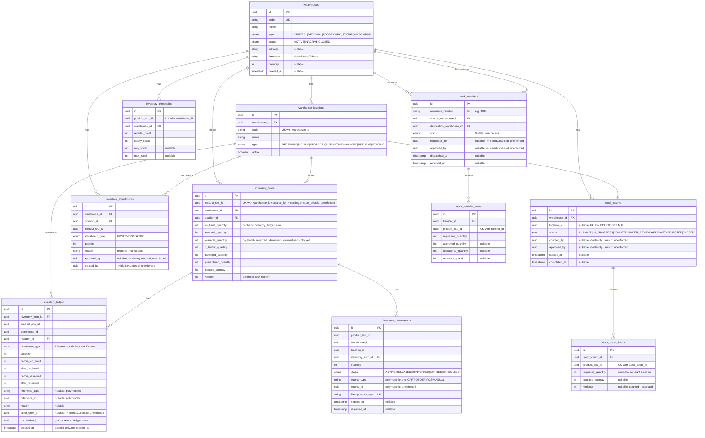

# Inventory ERD (Phase 006 — full detail)

Source of truth for the `inventory` schema, every column, every FK/UK, and
the design rationale behind the non-obvious choices. The `## inventory`
section in [`erd.md`](./erd.md) is an intentionally abbreviated summary that
links here; this document is the one to update whenever `inventory`'s
section of `packages/database/prisma/schema.prisma` changes.

Design rationale for the choices below: [`docs/adr/ADR-006-inventory-architecture.md`](../adr/ADR-006-inventory-architecture.md).
Module-level detail (what reads/writes these tables and how):
[`services/api/src/modules/inventory/README.md`](../../services/api/src/modules/inventory/README.md).

This schema replaces Phase 003's placeholder shape (`InventoryTransaction`,
`StockReservation`, `InventoryItem` keyed on `productVariantId`) — see the
migration's own header comment
(`packages/database/prisma/migrations/20260812180528_inventory_warehouse_ledger_foundation/migration.sql`)
for the exact old→new data-preserving mapping.

## Enums

```
WarehouseType                CENTRAL | REGIONAL | STORE | DARK_STORE | QUARANTINE
WarehouseStatus               ACTIVE | INACTIVE | CLOSED
LocationType                   RECEIVING | PICKING | STORAGE | QUARANTINE |
                                DAMAGED | RETURNS | STAGING
InventoryMovementType          PURCHASE_RECEIPT | SALE | RESERVATION |
                                RESERVATION_RELEASE | TRANSFER_OUT |
                                TRANSFER_IN | RETURN_RECEIPT | DAMAGE |
                                ADJUSTMENT | COUNT_ADJUSTMENT | QUARANTINE |
                                RELEASE_FROM_QUARANTINE | MANUAL_CORRECTION
InventoryReservationStatus     ACTIVE | RELEASED | CONVERTED | EXPIRED | CANCELLED
StockTransferStatus            DRAFT | REQUESTED | APPROVED | PICKING |
                                DISPATCHED | IN_TRANSIT | PARTIALLY_RECEIVED |
                                RECEIVED | CANCELLED
InventoryAdjustmentType        POSITIVE | NEGATIVE
StockCountStatus                PLANNED | IN_PROGRESS | COUNTED |
                                UNDER_REVIEW | APPROVED | REJECTED | CLOSED
```

`InventoryMovementType` is the brief's exact required 13-value vocabulary —
it replaces Phase 003's smaller `InventoryTransactionType` placeholder
(`PURCHASE`/`RELEASE`/`RETURN`/...). `StockTransferStatus`'s 9 states are
enforced by `TransferStateMachine` (domain layer) before any row is written
— see that service's own doc comment for the exact transition graph.

## Diagram



## Key design decisions

**`InventoryItem` is keyed `(product_sku_id, warehouse_id, location_id)`,
not just `(product_sku_id, warehouse_id)`.** A warehouse must have at least
one `WarehouseLocation` before it can hold stock — `WarehousesService.create()`
auto-creates a default `STORAGE`-type location named `MAIN` in the same
transaction as the warehouse row, so every warehouse created through the API
can immediately receive stock. See ADR-006 decision 1.

**Quantity buckets on `InventoryItem` are a maintained cache; `InventoryLedger`
is the source of truth.** All seven quantity columns (`on_hand_quantity`
through `blocked_quantity`, plus `available_quantity`) are recomputed and
written in the same transaction as the corresponding `InventoryLedger` row —
never trusted as already-correct input, never mutated by any code path that
skips writing a ledger entry. `InventoryLedger` has no `updated_at` column
and no repository method updates or deletes a row (append-only, ADR-006
decision 2).

**No database `CHECK` constraint for `available_quantity >= 0`.** Confirmed
directly against this Prisma version: `@@check(...)` is not a valid schema
attribute (`P1012`). The invariant is enforced transactionally instead —
`SELECT ... FOR UPDATE` row-locks the `InventoryItem`, then
`AvailableQuantityCalculator.assertNonNegative` runs before any write, inside
the same transaction as the write itself (ADR-006 decision 3). `version` is
a secondary optimistic-locking marker, incremented on every write, for a
future non-transactional caller — not load-bearing for correctness today
since the row lock already is.

**`inventory_ledger.reference_type`/`reference_id` and
`inventory_reservations.source_type`/`source_id` are deliberately
polymorphic, not foreign keys.** Same "cross-schema references are
intentionally unenforced" convention `docs/database/README.md` documents,
extended to same-schema polymorphic references here — the reservation's
source (a future cart, order, POS sale, or home-try-on) doesn't exist as a
table yet, and the ledger's reference (a transfer, adjustment, reservation,
or future order) varies by movement type. `correlation_id` is the mechanism
that ties related ledger rows together instead (e.g. a transfer dispatch's
two `TRANSFER_OUT` rows for one item share a `correlation_id`).

**`inventory_thresholds` is keyed `(product_sku_id, warehouse_id)`,
deliberately decoupled from `location_id`.** Low-stock rules are per-SKU-
per-warehouse per the brief's own wording — location-level granularity would
be a finer boundary than anything the brief asks for (ADR-006 decision 6).

**`stock_counts.location_id` is nullable with `ON DELETE SET NULL`**
(Prisma's default for an unannotated optional relation) — a count can be
scoped to a whole warehouse (all locations) or narrowed to one location.

## Cross-schema references (unenforced, same convention as `catalog`)

`inventory_items.product_sku_id`, `inventory_ledger.product_sku_id`,
`inventory_thresholds.product_sku_id`, `inventory_reservations.product_sku_id`,
`stock_transfer_items.product_sku_id`, `inventory_adjustments.product_sku_id`,
and `stock_count_items.product_sku_id` all reference
`catalog.product_skus.id` without a database foreign key — same rationale
`docs/database/README.md`'s "Cross-schema references are intentionally
unenforced" section gives for every other cross-schema pointer in this
repo. `*_by`/`actor_user_id` columns referencing `identity.users.id` follow
the same pattern.

## Migration

`packages/database/prisma/migrations/20260812180528_inventory_warehouse_ledger_foundation/`
— hand-authored, with a `down.sql` verified via a full up → down → up round
trip against real Postgres (`prisma migrate diff` confirmed zero drift at
every step, and Phase 005's catalog seed data survived the round trip
intact). See that migration's own header comment for the exact data-
preserving mapping from Phase 003's placeholder shape.
