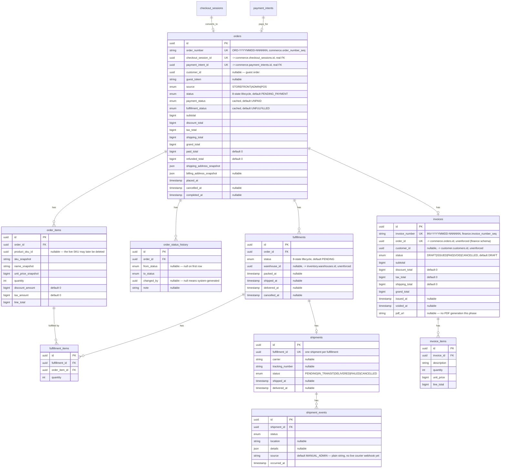

# Order ERD (Phase 009 — full detail)

Source of truth for the order/fulfillment/shipment portion of the
`commerce` schema and the invoice portion of the `finance` schema —
every column, every FK/UK, and the design rationale behind the
non-obvious choices. The `## commerce`/`## finance` sections in
[`erd.md`](./erd.md) are an intentionally abbreviated summary that links
here; this document is the one to update whenever this portion of
`packages/database/prisma/schema.prisma` changes.

Design rationale for the choices below: [`docs/adr/ADR-009-order-fulfillment.md`](../adr/ADR-009-order-fulfillment.md).
Module-level detail (what reads/writes these tables and how):
[`services/api/src/modules/order/README.md`](../../services/api/src/modules/order/README.md).

This migration **drops** Phase 003's placeholder `Order`/`OrderItem`/
`OrderStatusHistory`/`Invoice`/`InvoiceLine` (a shared placeholder
`OrderStatus` enum, no real payment/fulfillment link) and replaces them
entirely with the subtree below — the same "placeholder identified,
replaced with the real thing" precedent every prior phase set. `down.sql`
restores the exact pre-migration placeholder shape, verified via a full
up → down → up round trip.

## Enums

```
OrderSource             STOREFRONT | ADMIN | POS
OrderStatus             PENDING_PAYMENT | PAID | PROCESSING |
                          READY_TO_FULFILL | PARTIALLY_FULFILLED |
                          FULFILLED | CANCELLED | COMPLETED
OrderPaymentStatus       UNPAID | PARTIALLY_PAID | PAID |
                          PARTIALLY_REFUNDED | REFUNDED
OrderFulfillmentStatus   UNFULFILLED | PARTIALLY_FULFILLED | FULFILLED
FulfillmentStatus        PENDING | ALLOCATED | PROCESSING | PACKED |
                          READY | SHIPPED | DELIVERED | CANCELLED
ShipmentStatus           PENDING | IN_TRANSIT | DELIVERED | FAILED |
                          CANCELLED
InvoiceStatus            DRAFT | ISSUED | PAID | VOID | CANCELLED
```

`OrderPaymentStatus`/`OrderFulfillmentStatus` are cached reads alongside
`OrderStatus`, always derived from real data (`PaymentTransaction`/
`Refund` sums, `FulfillmentItem` sums respectively) — never
independently authoritative. Each enum's legal transition graph is
enforced by its own domain-layer state machine (`OrderStateMachine`,
`FulfillmentStateMachine`, `ShipmentStateMachine`, `InvoiceStateMachine`)
before any row is written — see each service's own doc comment for the
exact graph.

## Diagram



## Key design decisions

**`orders.checkout_session_id`/`orders.payment_intent_id` are real,
enforced, `@unique` FKs — both same-schema, unlike every prior module's
cross-schema pointers.** An `Order` is created from exactly one checkout
and exactly one payment intent, never more than once each; this is the
idempotency anchor `OrderConversionService.convertFromCheckout()`'s own
P2002-catch-and-reread safety relies on (ADR-009 decision 4). Every
order therefore always traces back to a real, verified payment — there
is no schema-level path to a manually-created, unpaid order.

**Three cached fields alongside one authoritative state machine.**
`status`/`payment_status`/`fulfillment_status` — the same "cache columns

- append-only/authoritative source" split `CheckoutSession` and
  `InventoryItem` already established in prior phases (ADR-009 decision 3).
  `payment_status`/`fulfillment_status` are never independently written by
  a client; both are always re-derived from `PaymentTransaction`/`Refund`
  sums or `FulfillmentItem` sums respectively.

**`order_items` snapshots everything a receipt needs.** `sku_snapshot`/
`name_snapshot`/`unit_price_snapshot` carry the historical truth
regardless of what happens to the live `ProductSku` afterward
(`product_sku_id` is nullable for exactly this reason) — an `Order` is
not a live view of the catalog (ADR-009 decision 1).

**`order_status_history` is append-only, no unique key on
`(order_id, to_status)`.** Every transition is its own row, `changed_by`
null meaning system-generated — same convention `system.AuditLog` uses.
Concurrency-safety against duplicate rows from a genuine race is enforced
at the repository layer (`SELECT ... FOR UPDATE` before deciding whether
to write), not by a database constraint — see the module README.

**`fulfillment_items.order_item_id` references a concrete `OrderItem`,
never a bare SKU string.** The over-fulfillment invariant (every
`FulfillmentItem.quantity` summed across every non-`CANCELLED`
`Fulfillment` for the same `order_item_id` never exceeds
`OrderItem.quantity`) is enforced in the domain/infrastructure layer via
a row-locked re-sum at write time (reusing `mutateInventoryItem`'s own
`SELECT ... FOR UPDATE` technique from Phase 006), not a database CHECK
constraint — Postgres has no cross-row aggregate constraint mechanism.

**`shipments.fulfillment_id` is `@unique` — one shipment per
fulfillment, not per order.** A partially-fulfilled order can have
multiple fulfillments, each shipping independently (ADR-009 decision
12). `shipment_events.source` is a plain string, not an enum — no live
courier webhook exists yet to give it a real closed vocabulary; always
`"MANUAL_ADMIN"` or `"SYSTEM"` this phase, deliberately not over-modeled
ahead of a real integration.

**`invoices.order_id` is `@unique` — at most one invoice per order, no
credit-note/re-issue mechanic this phase.** A correction is a `VOID`
(reachable from `ISSUED`/`PAID`) plus manual admin follow-up, not an
automatic re-issue (ADR-009 decision 7). `pdf_url` is nullable and
unused this phase — no PDF rendering pipeline exists yet.

**Two real Postgres sequences, not application-memory counters.**
`commerce.order_number_seq`/`finance.invoice_number_seq` — `nextval()` is
atomic at the database level, the concurrency-safety guarantee an
application-memory counter cannot honestly provide (ADR-009 decision 6).
Not expressible in `schema.prisma` (Prisma has no native sequence
primitive); hand-added via raw SQL at the end of the migration.

## Cross-schema references (unenforced, same convention as every other module)

`fulfillments.warehouse_id` references `inventory.warehouses.id`.
`orders.customer_id`/`invoices.customer_id` reference
`customer.customers.id`. `order_status_history.changed_by` references
`identity.users.id`. `invoices.order_id` itself is a cross-schema
pointer (`finance` -> `commerce`) despite being the one truly `@unique`
1:1 relationship in this subtree — Prisma/Postgres FKs cannot cross
schemas here any more than they can cross the other module boundaries in
this database, same rationale `docs/database/README.md`'s "Cross-schema
references are intentionally unenforced" section gives for every other
cross-schema pointer in this repo.

## Migration

`packages/database/prisma/migrations/20260814000000_order_fulfillment_foundation/`
— hand-authored, with a `down.sql` verified via a full up → down → up
round trip against real Postgres (`prisma migrate diff` confirmed zero
drift at every step; `catalog.products`/`inventory.warehouses`/
`commerce.carts`/`commerce.checkout_sessions`/`identity.users`/
`commerce.payment_intents`/`commerce.payment_transactions` row counts
confirmed intact throughout). The rollback restores the exact Phase 003
placeholder `orders`/`invoices` shape (0 rows either way — nothing to
carry back), so the round trip is reproducible regardless of how many
times it repeats.
