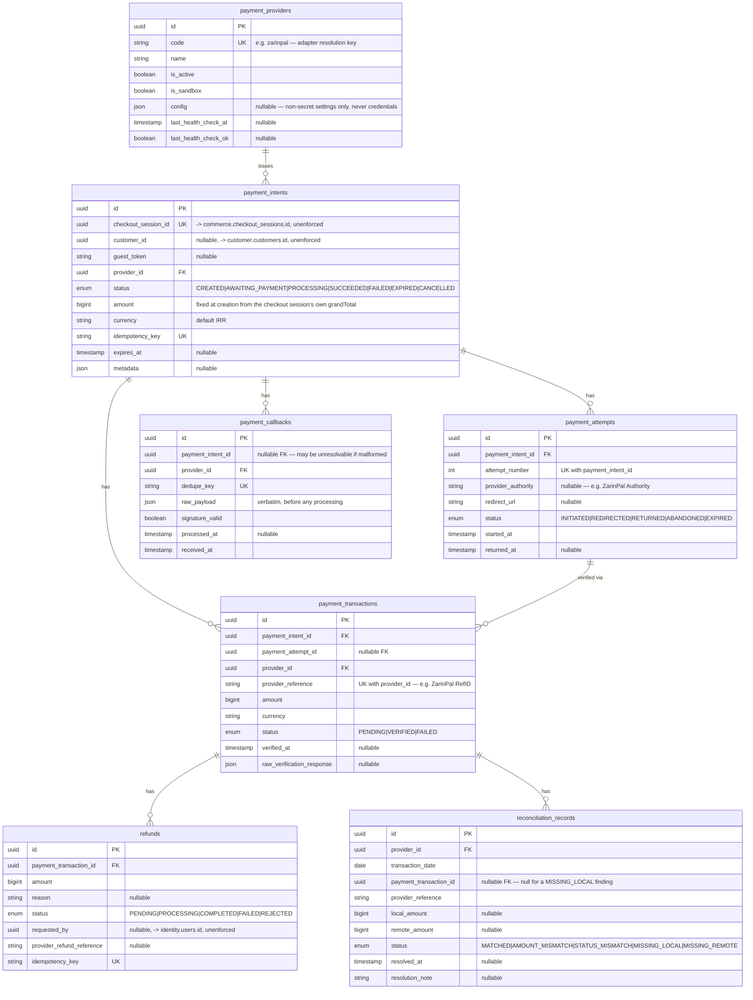

# Payment ERD (Phase 008 — full detail)

Source of truth for the payment orchestration portion of the `commerce`
schema, every column, every FK/UK, and the design rationale behind the
non-obvious choices. The `## commerce` section in
[`erd.md`](./erd.md) is an intentionally abbreviated summary that links
here; this document is the one to update whenever this portion of
`packages/database/prisma/schema.prisma` changes.

Design rationale for the choices below: [`docs/adr/ADR-008-payment-orchestration.md`](../adr/ADR-008-payment-orchestration.md).
Module-level detail (what reads/writes these tables and how):
[`services/api/src/modules/payment/README.md`](../../services/api/src/modules/payment/README.md).

This migration **drops** Phase 003's placeholder `Payment`/`Refund`/
`PaymentStatus`/`RefundStatus` (keyed on `orderId`, unusable — no `Order`
row exists anywhere in this codebase) and replaces them entirely with the
subtree below — the same "placeholder identified, replaced with the real
thing" precedent every prior phase set. `down.sql` restores the exact
pre-migration placeholder shape, verified via a full up → down → up round
trip.

## Enums

```
PaymentIntentStatus       CREATED | AWAITING_PAYMENT | PROCESSING |
                           SUCCEEDED | FAILED | EXPIRED | CANCELLED
PaymentAttemptStatus      INITIATED | REDIRECTED | RETURNED |
                           ABANDONED | EXPIRED
PaymentTransactionStatus  PENDING | VERIFIED | FAILED
RefundStatus              PENDING | PROCESSING | COMPLETED | FAILED |
                           REJECTED
ReconciliationStatus      MATCHED | AMOUNT_MISMATCH | STATUS_MISMATCH |
                           MISSING_LOCAL | MISSING_REMOTE
```

Each enum's legal transition graph is enforced by its own domain-layer
state machine (`PaymentIntentStateMachine`, `PaymentAttemptStateMachine`,
`PaymentTransactionStateMachine`, `RefundStateMachine`) before any row is
written — see each service's own doc comment for the exact graph.

## Diagram



## Key design decisions

**`payment_intents.checkout_session_id` is the real anchor, not
`order_id`.** `commerce.orders.customer_id` is non-nullable and no code
creates an `Order` row anywhere in this codebase (Phase 009) — the
Phase 003 placeholder `Payment.order_id` was unusable as designed. An
unenforced pointer (same convention every other same-schema-but-
different-module pointer in this repo follows), because this module
never imports cart-checkout's domain layer directly — real service
injection instead (ADR-008 decision 10).

**Three levels, not one.** Collapsing "intent to pay," "the redirect
round trip," and "the verified settlement record" into a single row (the
placeholder `Payment`'s implicit assumption) cannot represent a retried
checkout honestly — a customer can be redirected, abandon the page, come
back, and retry, and only one attempt actually settles. See ADR-008
decision 2.

**`payment_transactions` is `@unique([provider_id, provider_reference])`,
never updated once `VERIFIED`.** No repository method exposes an update
path for a `VERIFIED` row's `amount`/`status` — "successful transactions
immutable" is the brief's own explicit rule, made structural.

**`payment_callbacks` is a raw, append-only inbox — `dedupe_key` unique.**
Every inbound callback is persisted verbatim before any processing, so a
rejected callback still leaves an audit trail; a provider's well-known
habit of firing the same callback multiple times (at-least-once
delivery) is idempotent by construction. Never itself the source of
truth for whether payment succeeded (ADR-008 decision 4).

**`reconciliation_records` has no natural unique key.** Each
reconciliation run against the same transaction is its own timestamped
finding — the same "the ledger records, it doesn't silently fix itself"
discipline `InventoryLedger` established, reapplied here (ADR-008
decision 7). The only mutator (`resolve()`) sets `resolved_at`/
`resolution_note`, never `status`/`local_amount`/`remote_amount`.

**`payment_providers.config` never holds secrets.** Non-secret
operational settings only (callback URL template, request timeout,
sandbox flag); the real merchant id/API key come from environment
variables namespaced per provider `code`
(`PAYMENT_ZARINPAL_MERCHANT_ID`), read once at adapter construction,
never persisted to Postgres or returned by any endpoint (ADR-008
decision 8).

## Cross-schema references (unenforced, same convention as every other module)

`payment_intents.checkout_session_id` references
`commerce.checkout_sessions.id`. `payment_intents.customer_id` references
`customer.customers.id`. `refunds.requested_by` references
`identity.users.id`. All unenforced, same rationale
`docs/database/README.md`'s "Cross-schema references are intentionally
unenforced" section gives for every other cross-schema pointer in this
repo.

## Migration

`packages/database/prisma/migrations/20260813000000_payment_orchestration_foundation/`
— hand-authored, with a `down.sql` verified via a full up → down → up
round trip against real Postgres (`prisma migrate diff` confirmed zero
drift at every step; `catalog.products`/`inventory.warehouses`/
`commerce.checkout_sessions` row counts confirmed intact throughout). The
rollback restores the exact Phase 003 placeholder `payments`/`refunds`
shape (0 rows either way — nothing to carry back), so the round trip is
reproducible regardless of how many times it repeats.
