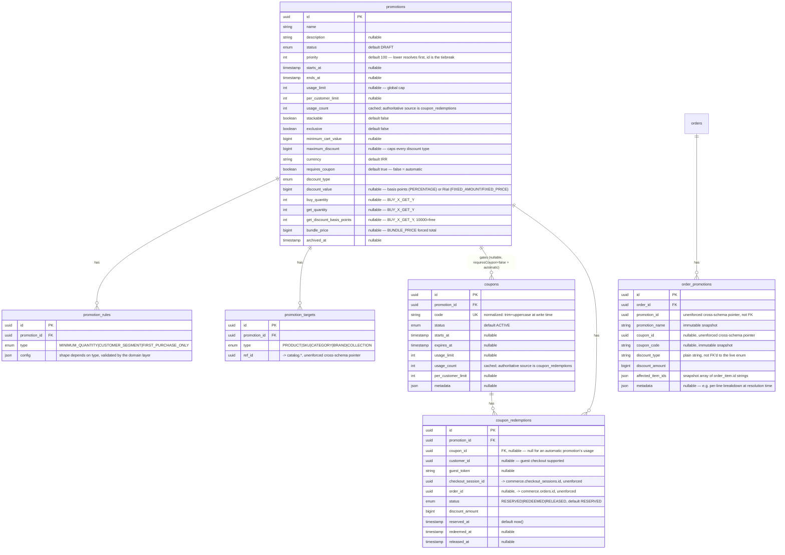

# Promotion/coupon ERD (Phase 010 — full detail)

Source of truth for the promotion/coupon portion of the `marketing`
schema and the `commerce.order_promotions` snapshot table — every
column, every FK/UK, and the design rationale behind the non-obvious
choices. The `## marketing` section in [`erd.md`](./erd.md) is an
intentionally abbreviated summary that links here; this document is the
one to update whenever this portion of
`packages/database/prisma/schema.prisma` changes.

Design rationale for the choices below: [`docs/adr/ADR-010-promotion-engine.md`](../adr/ADR-010-promotion-engine.md).
Module-level detail (what reads/writes these tables and how):
[`services/api/src/modules/promotion/README.md`](../../services/api/src/modules/promotion/README.md).

This migration **drops** Phase 003's placeholder `Coupon`/
`CouponRedemption`/`Promotion`/`PromotionProduct` (a ruleless,
all-or-nothing percent/fixed discount scoped to a flat product list, no
eligibility engine, no stacking, no coupon lifecycle, no concurrency-safe
redemption ledger) and replaces them entirely with the subtree below —
the same "placeholder identified, replaced with the real thing"
precedent every prior phase set. `down.sql` restores the exact
pre-migration placeholder shape, verified via a full up → down → up
round trip with real row-count preservation on every other table in the
database.

## Enums

```
PromotionStatus       DRAFT | SCHEDULED | ACTIVE | PAUSED | EXPIRED | ARCHIVED
PromotionActionType   PERCENTAGE | FIXED_AMOUNT | FIXED_PRICE |
                        FREE_SHIPPING | BUY_X_GET_Y | BUNDLE_PRICE
PromotionTargetType   PRODUCT | SKU | CATEGORY | BRAND | COLLECTION
PromotionRuleType     MINIMUM_QUANTITY | CUSTOMER_SEGMENT | FIRST_PURCHASE_ONLY
CouponStatus          ACTIVE | PAUSED | EXPIRED | DISABLED
RedemptionStatus      RESERVED | REDEEMED | RELEASED
```

`PromotionTargetType` has no `ALL` value — zero `promotion_targets` rows
for a promotion already means "the whole cart" unambiguously (ADR-010
decision 4). Each enum's legal transition graph is enforced by its own
domain-layer state machine (`PromotionLifecycle`, `CouponLifecycle`)
before any row is written, not by the database — the database enforces
the _usage-limit_ invariant instead (see "Two real invariants" below).

## Diagram



`coupon_redemptions.checkout_session_id`/`order_id` and
`order_promotions.promotion_id`/`coupon_id` are deliberately unenforced
cross-schema pointers — same convention every cross-schema reference in
this database already uses (see
[`README.md`](./README.md#cross-schema-references-are-intentionally-unenforced)).
`order_promotions.discount_type` is stored as a **plain string**, not an
FK'd/typed reference to the live `PromotionActionType` enum — a
deliberate decoupling documented on the model itself: an order's snapshot
must stay readable even if a future migration ever renames or removes a
discount type from the live enum, since the snapshot describes what
_was_ applied at order time, not what the enum contains today.

## Two real invariants, enforced by the database, not just application code

- **Usage-limit safety** (ADR-010 decision 8, §30's mandatory
  invariant) — `PrismaCouponRepository.reserve()` row-locks the coupon
  (or promotion, couponless path) with `SELECT ... FOR UPDATE` inside a
  transaction and re-sums already-active redemptions under that lock
  before inserting. A real Postgres `CHECK` constraint backstops the
  cached counter directly:

  ```sql
  ALTER TABLE marketing.promotions
    ADD CONSTRAINT promotion_usage_within_limit
    CHECK (usage_limit IS NULL OR usage_count <= usage_limit);

  ALTER TABLE marketing.coupons
    ADD CONSTRAINT coupon_usage_within_limit
    CHECK (usage_limit IS NULL OR usage_count <= usage_limit);
  ```

  Verified present: `\d marketing.coupons`/`\d marketing.promotions`
  both show their own `Check constraints:` entry. Prisma's schema DSL has
  no stable way to declare a `CHECK` constraint, so both live only in the
  hand-authored `migration.sql`, with a doc comment on each model pointing
  here rather than a (non-existent) `@@check` line.

- **One redemption row per (checkout, promotion) pair** —
  `@@unique([checkoutSessionId, promotionId])` on `coupon_redemptions`.
  Re-pricing/re-freezing the same checkout for the same promotion
  **updates** the existing row rather than creating a second one — the
  same idempotent-by-construction shape `checkout_reservations`/
  `cart_coupons` already use.

## Coupon code normalization is a real unique constraint, not an app-level convention

`coupons.code` stores the already-normalized value (`CouponCode.normalize()`
— trim + uppercase, domain value object) and `code UK` is a genuine
Postgres unique index — `didar20`/`DIDAR20`/`DiDaR20` can never exist as
two rows even from a raw insert that bypasses the application entirely.

## `order_promotions` lives in `commerce`, not `marketing`

The immutable per-order promotion snapshot is a **commerce** concern (it
belongs to the order aggregate, the same way `order_items` does), not a
marketing one — `order_promotions.order_id` is a real, enforced,
same-schema FK (`onDelete: Cascade`, matching `order_items`'s own
cascade), while its `promotion_id`/`coupon_id` fields are unenforced
pointers back into `marketing`, since the live promotion/coupon rows may
be edited, paused, or archived long after the order that used them is
final. This is the exact "order ≠ live product" principle
[`README.md`](./README.md#conventions) already documents for
`order_items`, applied here to promotions.

## What Phase 003's placeholder looked like, for contrast

```
coupons              { id, code UK, type (PERCENTAGE|FIXED_AMOUNT),
                        value, usage_limit, per_user_limit, is_active }
coupon_redemptions   { id, coupon_id FK, order_id, customer_id, discount_amount }
promotions           { id, name, discount_type, discount_value, starts_at, ends_at }
promotion_products    { promotion_id PK/FK, product_id PK }
```

No eligibility rules, no targeting beyond a flat product list, no
stacking/exclusivity concept, no coupon lifecycle beyond a boolean
`is_active`, and no concurrency-safe reservation ledger at all (a
redemption row was written directly at order time with no reserve/
release step). Every one of these gaps is what this phase's real schema
closes.
