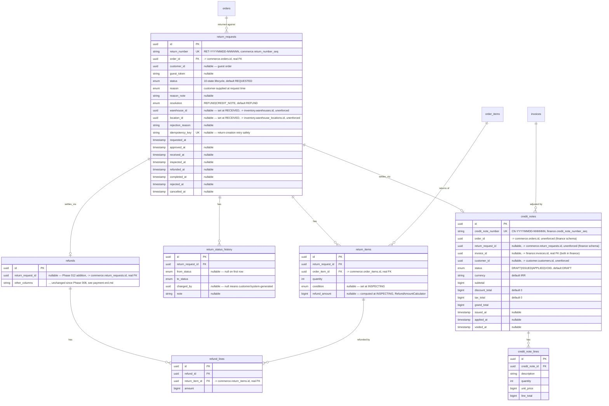

# Returns / refunds / credit-notes ERD (Phase 012)

Source of truth for the return-request portion of the `commerce` schema,
the additive `refunds`/new `refund_lines` extension (also `commerce`),
and the credit-note portion of the `finance` schema — every column,
every FK/UK, and the design rationale behind the non-obvious choices.
The `## commerce`/`## finance` sections in [`erd.md`](./erd.md) are an
intentionally abbreviated summary that links here; this document is the
one to update whenever this portion of
`packages/database/prisma/schema.prisma` changes.

Design rationale for the choices below: [`docs/adr/ADR-012-returns-refunds-credit-notes.md`](../adr/ADR-012-returns-refunds-credit-notes.md).
Module-level detail (what reads/writes these tables and how):
[`services/api/src/modules/return/README.md`](../../services/api/src/modules/return/README.md).

This migration is **purely additive** — no table drops, no data
transforms, no destructive operations. Every existing `commerce.refunds`
column and row is untouched; the return/credit-note subtree is entirely
new tables.

## Enums

```
ReturnStatus          REQUESTED | APPROVED | CUSTOMER_SHIPPING |
                        RECEIVED | INSPECTING | APPROVED_FOR_REFUND |
                        REFUNDED | COMPLETED | REJECTED | CANCELLED
ReturnReason           DAMAGED | DEFECTIVE | WRONG_ITEM |
                        NOT_AS_DESCRIBED | CHANGED_MIND |
                        SIZE_FIT_ISSUE | OTHER
ReturnResolution       REFUND | CREDIT_NOTE
ReturnItemCondition    UNOPENED | OPENED_UNUSED | USED | DAMAGED |
                        DEFECTIVE
CreditNoteStatus       DRAFT | ISSUED | APPLIED | VOID
```

Each enum's legal transition graph is enforced by its own domain-layer
state machine (`ReturnStateMachine`, `CreditNoteStateMachine`) before any
row is written — see each service's own doc comment for the exact graph.
`ReturnItemCondition` is not a state machine — it's a one-time
observation recorded at `INSPECTING`, never itself transitioned.

## Diagram



## Key design decisions

**`return_requests.order_id` is a real, enforced FK — unlike
`credit_notes.order_id`/`invoices.order_id`.** A return always traces
back to a real order in the same schema; `ON DELETE RESTRICT` (an order
with an open return can't be deleted out from under it, though nothing
in this codebase deletes orders in the first place — same defensive
posture `order_items.order_id` already uses).

**`return_items.order_item_id` is a real, enforced FK, never a bare SKU
string.** The return-quantity invariant (every `ReturnItem.quantity`
summed across every non-`REJECTED`/non-`CANCELLED` `ReturnRequest` for
the same `order_item_id` never exceeds `OrderItem.quantity`) is enforced
in the infrastructure layer via a row-locked re-sum at write time
(`lockAndSumReturnedQuantity()`, the direct analogue of Phase 009's
`lockAndSumFulfilled()`), not a database `CHECK` constraint — Postgres
has no cross-row aggregate constraint mechanism, the same limitation
`order-erd.md`'s own over-fulfillment invariant already documents.

**`return_items.refund_amount` is nullable and computed once, at
`INSPECTING`, independent of the later accept/reject decision.**
`RefundAmountCalculator` derives it purely from `OrderItem`'s own
immutable snapshot (`lineTotal - discountAmount + taxAmount`, divided
across the line's quantity with a deterministic floor-rounded remainder
allocation) — never from `OrderPromotion` or the live catalog. A
rejected `ReturnItem` still has this value recorded (useful for
"what would have been refunded" audit visibility) even though no
settlement is ever created for it.

**`refunds.return_request_id` is additive and nullable — the existing
`refunds` table, every existing column, and every existing row are
untouched.** A `Refund` created by `OrderService.cancel()`/
`.requestPartialRefund()` (Phase 008/009, unchanged) simply never sets
it. `refund_lines` is a new child table (`refund_id` FK, `return_item_id`
FK, `amount`) — the per-`ReturnItem` breakdown of one `Refund`'s total
`amount`, the same "child entity, no independent lifecycle" shape
`order_items`/`fulfillment_items` already use. **There remains exactly
one refund pathway** (`RefundService.requestRefund()`/`processRefund()`)
— this phase extends the aggregate, never duplicates it.

**`credit_notes.invoice_id` is the one real, enforced FK in this table —
`order_id`/`return_request_id`/`customer_id` stay plain, unenforced
`uuid` columns**, matching `invoices.order_id`'s own convention exactly
even though a real FK would be technically possible for
`return_request_id` (same schema, `commerce`... except `credit_notes`
itself lives in `finance`, so every one of `order_id`/`return_request_id`
is necessarily a cross-schema pointer — kept unenforced for the same
"each domain schema should be reason-about-able on its own" rationale
`docs/database/README.md`'s "Cross-schema references are intentionally
unenforced" section gives for every other cross-schema pointer in this
repo). `invoice_id` is real because both rows live in `finance` — no
schema boundary to cross. `Invoice` itself is never mutated when a
`CreditNote` is issued against it — no column on `invoices` changes;
the two rows together represent the adjustment.

**A real Prisma schema-authoring pitfall, found and fixed while
authoring this migration**: `prisma format`/`validate` auto-completes a
same-named relation field into a real, enforced FK the instant a
matching array/scalar relation exists on either side, even across
schemas. An early draft's `ReturnRequest.creditNotes CreditNote[]`
back-relation (never actually needed — nothing reads `CreditNote`
through `ReturnRequest`) kept silently reintroducing a
`commerce -> finance` FK this schema's own unenforced-cross-schema
convention rules out. Fixed by removing the stray back-relation
entirely, not by fighting the formatter field-by-field.

**Two real Postgres sequences, not application-memory counters.**
`commerce.return_number_seq`/`finance.credit_note_number_seq` —
`nextval()` is atomic at the database level, drawn inside the same
transaction as the insert, identical technique to
`order_number_seq`/`invoice_number_seq` (Phase 009). Not expressible in
`schema.prisma` (Prisma has no native sequence primitive); hand-added
via raw SQL at the end of the migration.

## Cross-schema references (unenforced, same convention as every other module)

`return_requests.warehouse_id`/`location_id` reference
`inventory.warehouses.id`/`inventory.warehouse_locations.id`.
`return_status_history.changed_by` references `identity.users.id`.
`credit_notes.order_id`/`return_request_id` reference
`commerce.orders.id`/`commerce.return_requests.id`. `credit_notes
.customer_id` references `customer.customers.id`. None of these are
database-enforced — see `docs/database/README.md`'s "Cross-schema
references are intentionally unenforced" section for the full rationale.

## Migration

`packages/database/prisma/migrations/20260820000000_returns_refunds_credit_notes/`
— hand-authored, purely additive (no table drops, no data transforms).
Verified against the live dev database before authoring (`commerce
.orders`: 545, `commerce.order_items`: 546, `commerce.refunds`: 78,
`finance.invoices`: 545, `commerce.fulfillments`: 243 — real seed +
e2e-generated data, not an empty table) and after: applied, then
round-tripped UP → DOWN → UP with row counts identical throughout, and
`prisma migrate diff` run against a fresh shadow database confirming
zero drift in both directions (live database vs. shadow, shadow vs.
`schema.prisma`) — not merely a syntax check.

A real schema-authoring bug was caught this way, not by reading the SQL:
the stray `ReturnRequest.creditNotes` back-relation described above,
found while resolving an unexpected cross-schema FK `prisma format`
regenerated.
